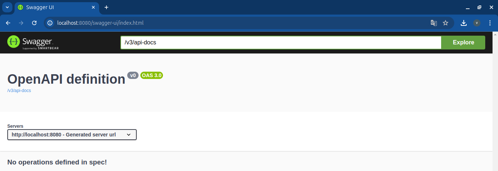

# Proyecto: Práctica de API REST con Base de Datos H2, Swagger y Docker
# Introducción a Swagger y H2

## Swagger

### ¿Qué es Swagger?
Swagger es un conjunto de herramientas de software de código abierto para diseñar, construir, documentar y utilizar servicios web RESTful. Permite a los desarrolladores crear documentación interactiva para sus APIs, lo que facilita la comprensión y el uso de los servicios ofrecidos.

### Beneficios de Swagger:
- **Documentación Automática**: Genera documentación de la API automáticamente a partir del código fuente.
- **Interfaz Interactiva**: Proporciona una interfaz web interactiva para probar las distintas operaciones de la API directamente desde el navegador.
- **Especificación Estándar**: Utiliza la especificación OpenAPI, que es un estándar ampliamente aceptado para describir APIs RESTful.
- **Facilita el Desarrollo**: Ayuda a los desarrolladores a entender rápidamente las funcionalidades de la API y a integrarlas en sus aplicaciones.

### Componentes Clave de Swagger:
- **Swagger UI**: Interfaz de usuario interactiva que permite explorar y probar las operaciones de la API.
- **Swagger Editor**: Herramienta para escribir y editar especificaciones OpenAPI.
- **Swagger Codegen**: Genera código cliente y servidor a partir de una especificación OpenAPI.

### Cómo Acceder a Swagger en el Proyecto:
- Una vez que el proyecto esté levantado, pueden acceder a la documentación de Swagger en la siguiente URL: [http://localhost:8080/swagger-ui.html](http://localhost:8080/swagger-ui.html).




---

## H2

### ¿Qué es H2?
H2 es una base de datos relacional en memoria que se utiliza principalmente para el desarrollo, pruebas y demostraciones. Es una base de datos de código abierto, escrita en Java, que puede ser incrustada en aplicaciones Java o ejecutada en modo cliente-servidor.

### Beneficios de H2:
- **Ligera y Rápida**: Ideal para desarrollo y pruebas debido a su rapidez y bajo consumo de recursos.
- **Base de Datos en Memoria**: Permite crear bases de datos que residen en la memoria RAM, lo que hace que las operaciones sean muy rápidas.
- **Interfaz Web**: Proporciona una consola web que facilita la ejecución de consultas SQL y la administración de la base de datos.
- **Compatibilidad**: Compatible con JDBC y puede ser integrada fácilmente en aplicaciones Java.

### Componentes Clave de H2:
- **Base de Datos en Memoria**: Se crea y reside en la memoria RAM mientras la aplicación está en ejecución.
- **Consola H2**: Interfaz web para interactuar con la base de datos. Permite ejecutar consultas SQL y ver los datos almacenados.

### Cómo Acceder a la Consola H2 en el Proyecto:
- Una vez que el proyecto esté levantado, pueden acceder a la consola de la base de datos H2 en la siguiente URL: [http://localhost:8080/h2-console](http://localhost:8080/h2-console).
- Deberán ingresar las credenciales configuradas en el proyecto para acceder a la consola y realizar consultas SQL.

---

# Configuración de Swagger y H2 en un Proyecto Spring Boot

## Configuración de Swagger

### Paso 1: Agregar Dependencias
Añade las siguientes dependencias en tu archivo `pom.xml` si estás utilizando Maven:
Spring Boot 3.x requiere utilizar la versión 2 de springdoc-openapi :
```xml
<dependency>
    <groupId>org.springdoc</groupId>
    <artifactId>springdoc-openapi-starter-webmvc-ui</artifactId>
    <version>2.5.0</version>
</dependency>
```

Estas herramientas, Swagger y H2, serán fundamentales en el desarrollo del proyecto, ya que facilitarán la documentación, prueba y administración de la API y su base de datos.
## Paso 2: Configurar Swagger
Crea una clase de configuración para Swagger en tu proyecto Spring Boot:
```java
import org.springframework.context.annotation.Bean;
import org.springframework.context.annotation.Configuration;
import springfox.documentation.builders.PathSelectors;
import springfox.documentation.builders.RequestHandlerSelectors;
import springfox.documentation.spi.DocumentationType;
import springfox.documentation.spring.web.plugins.Docket;
import springfox.documentation.swagger2.annotations.EnableSwagger2;

@Configuration
@EnableSwagger2
public class SwaggerConfig {
    @Bean
    public Docket api() {
        return new Docket(DocumentationType.SWAGGER_2)
                .select()
                .apis(RequestHandlerSelectors.basePackage("com.tu.paquete"))
                .paths(PathSelectors.any())
                .build();
    }
}
```
## Paso 3: Acceder a Swagger UI
Levanta tu aplicación Spring Boot y accede a Swagger UI en la siguiente URL:
[http://localhost:8080/swagger-ui.html](http://localhost:8080/swagger-ui.html).

## Configuración de H2
## Paso 1: Agregar Dependencia
Añadir la siguiente dependencia en tu archivo pom.xml:
```xml
<dependency>
    <groupId>com.h2database</groupId>
    <artifactId>h2</artifactId>
    <scope>runtime</scope>
</dependency>
```
## Paso 2: Configurar la Base de Datos H2
Configura las propiedades de H2 en tu archivo application.properties o application.yml:
Para `application.properties`:
```properties
spring.datasource.url=jdbc:h2:mem:testdb
spring.datasource.driverClassName=org.h2.Driver
spring.datasource.username=sa
spring.datasource.password=password
spring.h2.console.enabled=true
spring.h2.console.path=/h2-console
spring.datasource.platform=h2
spring.jpa.database-platform=org.hibernate.dialect.H2Dialect
spring.jpa.hibernate.ddl-auto=update
```
Para `application.yml`:
```yml
spring:
  datasource:
    url: jdbc:h2:mem:testdb
    driverClassName: org.h2.Driver
    username: sa
    password: password
    platform: h2
  h2:
    console:
      enabled: true
      path: /h2-console
  jpa:
    database-platform: org.hibernate.dialect.H2Dialect
    hibernate:
      ddl-auto: update
```
## Paso 3: Acceder a la Consola H2
Levanta tu aplicación Spring Boot y accede a la consola H2 en la siguiente URL:
[http://localhost:8080/h2-console.html](http://localhost:8080/h2-console.html).
Introduce las siguientes credenciales para acceder:
- JDBC URL: `jdbc:h2:mem:testdb`
- User Name: `sa`
- Password: `password`
  
## Objetivos:
1. Desarrollar una API REST utilizando una base de datos H2 que se crea automáticamente al levantar el proyecto con datos de prueba.
2. Explorar la documentación generada automáticamente mediante Swagger.
3. Interactuar con la base de datos H2 a través de su consola web.
4. Desplegar y probar la API en un entorno de servidor gratuito.
5. Dockerizar el proyecto para su fácil despliegue y distribución.
   

## Instrucciones:
1. **Configuración y puesta en marcha del proyecto**:
   - Levantar el proyecto y verificar que la base de datos se crea automáticamente con los datos de prueba.
   - Acceder a la consola de la base de datos H2 a través de la siguiente URL: [http://localhost:8080/h2-console](http://localhost:8080/h2-console).
   - Explorar la documentación generada por Swagger en: [http://localhost:8080/swagger-ui.html](http://localhost:8080/swagger-ui.html).

2. **Prueba de la API desplegada**:
   - Realizar peticiones a la API desplegada en un servidor gratuito.
   - Para obtener todos los usuarios, usen la siguiente URL: [https://user-api-1-0.onrender.com/users](https://user-api-1-0.onrender.com/users).
   - Para crear un nuevo usuario, realizar una petición POST a: [https://user-api-1-0.onrender.com/users](https://user-api-1-0.onrender.com/users) con el siguiente JSON en el cuerpo de la solicitud:
     ```json
     {
         "name": "username01",
         "password": "password123"
     }
     ```

3. **Dockerización del proyecto**:
# Añadiendo Docker al Proyecto Spring Boot

## Paso a Paso para Dockerizar el Proyecto

### Paso 1: Crear un Archivo Dockerfile
En el directorio raíz de tu proyecto, crea un archivo llamado `Dockerfile` con el siguiente contenido:

```Dockerfile
# Utiliza una imagen base de OpenJDK 11 con Alpine Linux
FROM openjdk:21

# Establece el directorio de trabajo dentro del contenedor
WORKDIR /app

# Copia el archivo JAR del proyecto al directorio de trabajo del contenedor
COPY target/tu-proyecto-0.0.1-SNAPSHOT.jar app.jar

# Expone el puerto en el que la aplicación escuchará
EXPOSE 8080

# Comando para ejecutar la aplicación
ENTRYPOINT ["java", "-jar", "app.jar"]
```
## Paso 2: Crear el JAR del Proyecto
Ejecuta el siguiente comando en la terminal para construir el proyecto y generar el archivo JAR:
```sh 
mvn clean package
```
Este comando generará un archivo JAR en el directorio `target` del proyecto.

## Paso 3: Construir la Imagen Docker
Ejecuta el siguiente comando en la terminal desde el directorio raíz de tu proyecto para construir la imagen Docker:
```sh
docker build -t tu-nombre-de-usuario/tu-proyecto:latest .
```
## Paso 4: Ejecutar el Contenedor Docker
Ejecuta el siguiente comando para correr el contenedor Docker:
```sh
docker run -p 8080:8080 tu-nombre-de-usuario/tu-proyecto:latest
```
Este comando mapeará el puerto 8080 del contenedor al puerto 8080 de tu máquina, permitiéndote acceder a la aplicación en http://localhost:8080.

## Material Entregable:
1. **Documentación del Proyecto**:
   - Descripción del funcionamiento del API.
   - Pasos para levantar el proyecto y acceder a la base de datos H2 y Swagger.
   - Ejemplos de peticiones y respuestas para las principales operaciones de la API.

2. **Capturas de Pantalla**:
   - Consola de la base de datos H2 con ejemplos de consultas.
   - Interfaz de Swagger con ejemplos de peticiones y respuestas.
   - Pruebas de la API desplegada en el servidor gratuito (capturas de las respuestas de las peticiones GET y POST).

3. **Dockerización**:
   - Archivo Dockerfile utilizado.
   - Instrucciones para descargar y correr la imagen Docker desde el repositorio.

4. **Código Fuente del Proyecto**:
   - Subido a un repositorio GitHub con acceso compartido a los instructores.

## Fecha de Entrega:
- El proyecto deberá ser entregado completo antes del [].

