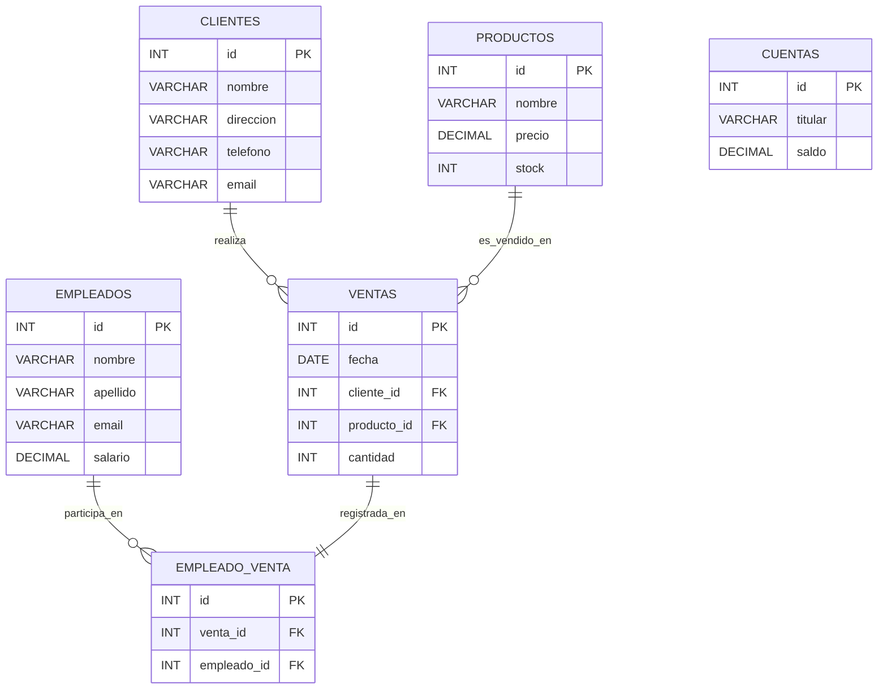

# Ejercicios JDBC

Script de Base de Datos MySQL para los ejercicios JDBC
```sql
-- Crear la base de datos
CREATE DATABASE IF NOT EXISTS empresa;
USE empresa;

-- Tabla: empleados
CREATE TABLE IF NOT EXISTS empleados (
    id INT AUTO_INCREMENT PRIMARY KEY,
    nombre VARCHAR(50) NOT NULL,
    apellido VARCHAR(50) NOT NULL,
    email VARCHAR(100) UNIQUE NOT NULL,
    salario DECIMAL(10,2) NOT NULL
);

-- Tabla: productos
CREATE TABLE IF NOT EXISTS productos (
    id INT AUTO_INCREMENT PRIMARY KEY,
    nombre VARCHAR(100) NOT NULL,
    precio DECIMAL(10,2) NOT NULL,
    stock INT NOT NULL
);

-- Tabla: cuentas (para transacciones)
CREATE TABLE IF NOT EXISTS cuentas (
    id INT AUTO_INCREMENT PRIMARY KEY,
    titular VARCHAR(100) NOT NULL,
    saldo DECIMAL(10,2) NOT NULL
);

-- Tabla: clientes
CREATE TABLE IF NOT EXISTS clientes (
    id INT AUTO_INCREMENT PRIMARY KEY,
    nombre VARCHAR(100) NOT NULL,
    direccion VARCHAR(150),
    telefono VARCHAR(20),
    email VARCHAR(100) UNIQUE
);

-- Datos iniciales para pruebas
INSERT INTO empleados (nombre, apellido, email, salario) VALUES
('Ana', 'Martínez', 'ana.martinez@empresa.com', 3200.00),
('Luis', 'Gómez', 'luis.gomez@empresa.com', 2800.00);

INSERT INTO productos (nombre, precio, stock) VALUES
('Teclado', 25.50, 100),
('Mouse', 18.00, 150),
('Monitor', 150.00, 30);

INSERT INTO cuentas (titular, saldo) VALUES
('Carlos Pérez', 1000.00),
('Sofía Ramírez', 2000.00);

INSERT INTO clientes (nombre, direccion, telefono, email) VALUES
('Juan Torres', 'Av. Libertad 123', '123456789', 'juan.torres@correo.com'),
('María López', 'Calle Falsa 456', '987654321', 'maria.lopez@correo.com');
```



### Ejercicio 1: Conexión a la base de datos
Crea una aplicación Java que se conecte a una base de datos MySQL llamada empresa. Verifica la conexión y muestra un mensaje por consola indicando si la conexión fue exitosa o no.

### Ejercicio 2: Insertar registros
Escribe un programa en Java que inserte un nuevo registro en la tabla empleados con los campos: id, nombre, apellido, email, salario.

### Ejercicio 3: Leer registros
Desarrolla un programa que consulte todos los registros de la tabla productos y los muestre en consola.
La tabla tiene los campos: id, nombre, precio, stock.

### Ejercicio 4: Búsqueda por parámetro
Modifica el ejercicio anterior para que el usuario pueda buscar productos por nombre (o parte del nombre) desde la consola.

### Ejercicio 5: Actualizar registros
Crea una función que permita actualizar el salario de un empleado, recibiendo como parámetros su id y el nuevo salario.

### Ejercicio 6: Eliminar registros
Implementa un método que elimine un registro de la tabla empleados recibiendo el id como parámetro.

### Ejercicio 7: Uso de PreparedStatement
Reescribe los ejercicios 2, 4 y 5 utilizando PreparedStatement en lugar de Statement, para evitar inyecciones SQL.

### Ejercicio 8: Transacciones
Simula una transferencia bancaria entre dos cuentas de la tabla cuentas (id, titular, saldo).
Crea una transacción que:
1. Reste el monto de una cuenta origen.
2. Sume el mismo monto a la cuenta destino.
3. Si ocurre un error en cualquier paso, revierte la transacción.

### Ejercicio 9: Patrón DAO
Implementa una clase DAO (ProductoDAO) que tenga métodos para insertar, actualizar, eliminar y listar productos. Utiliza buenas prácticas como separación de lógica, manejo de conexiones, y reutilización de código.

###  Ejercicio 10: Interfaz de usuario simple
Crea una interfaz por consola para interactuar con una tabla clientes y permitir al usuario:
- Listar todos los clientes.
- Buscar un cliente por ID.
- Insertar un nuevo cliente.
- Actualizar su información.
- Eliminarlo.

