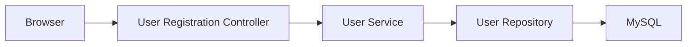
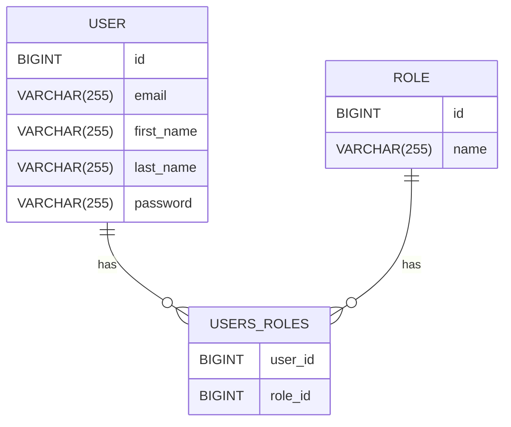
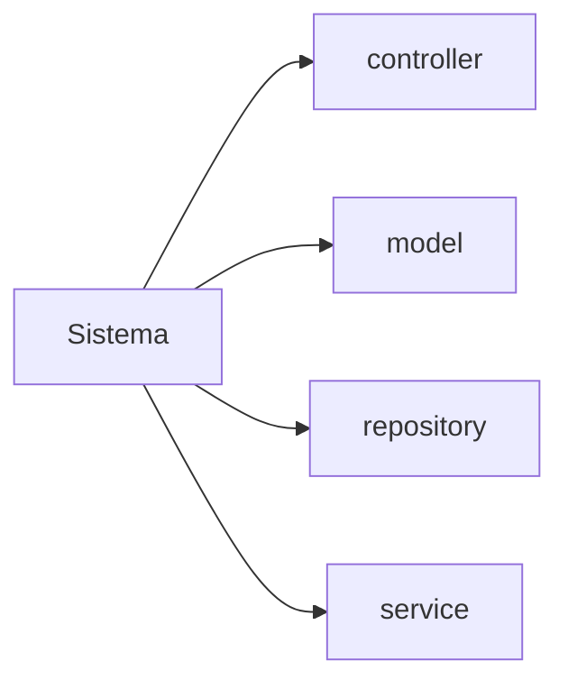

# Tutorial Spring Security - Registration, Login, y Logout
# Desarrollo de funciones de registro, inicio de sesión y cierre de sesión con Spring Boot

En este tutorial, aprenderemos cómo desarrollar funciones de **registro**, **inicio de sesión** y **cierre de sesión** utilizando **Spring Boot**, **Spring Security**, **Spring Data JPA**, **Thymeleaf** y la base de datos **MySQL**.

## Objetivos
- Crear una aplicación web **Spring MVC** utilizando:
  - **Spring Boot** para la configuración del proyecto.
  - **Spring Security** para la gestión de autenticación y autorización.
  - **Spring Data JPA** para la interacción con la base de datos.
  - **Thymeleaf** como motor de plantillas para la vista.
  - **MySQL** como base de datos para almacenar la información de usuarios.

## Tecnologías utilizadas
1. **Spring Boot**: Para facilitar la configuración y puesta en marcha de la aplicación.
2. **Spring Security**: Para proporcionar autenticación y autorización.
3. **Spring Data JPA**: Para la interacción con la base de datos.
4. **Thymeleaf**: Para crear las vistas de la aplicación web.
5. **MySQL**: Base de datos relacional para almacenar información de usuarios y sesiones.

### ¿Qué aprenderás?
### 1. **Creación de una Aplicación Web Spring MVC con Spring Boot**
   - Aprenderás a crear una aplicación web basada en el patrón **Spring MVC** utilizando el marco **Spring Boot**, que simplifica la configuración y el desarrollo.

### 2. **Configuración de la Seguridad en el Proyecto con Spring Security**
   - Descubrirás cómo **configurar Spring Security** para proporcionar un sistema de autenticación y autorización robusto dentro de tu proyecto Spring Boot.

### 3. **Desarrollo de la Funcionalidad de Registro de Usuario**
   - Implementación completa de un sistema de **registro de usuarios**, desde el formulario de registro hasta la persistencia en la base de datos, garantizando la seguridad de los datos.

### 4. **Implementación de Funciones Personalizadas de Inicio de Sesión**
   - Configuración de un sistema de **inicio de sesión personalizado** que interactúa con la base de datos, validando usuarios y protegiendo rutas sensibles dentro de la aplicación.

### 5. **Autenticación con Spring Security utilizando UserDetailsService respaldado por una Base de Datos**
   - Implementaremos **UserDetailsService**, una clase que integra **Spring Security** con **JPA** para autenticar usuarios desde una base de datos MySQL.

### 6. **Funcionalidad de Cierre de Sesión en Spring Security**
   - Aprenderás a habilitar y personalizar la funcionalidad de **cierre de sesión**, que permitirá a los usuarios cerrar sesión de forma segura.

### 7. **Creación de Entidades JPA - Usuario y Rol (Relación Muchos a Muchos)**
   - Aprenderás a definir **entidades JPA** para modelar la relación entre usuarios y roles en una estructura de **muchos a muchos**, garantizando flexibilidad en la autorización.

### 8. **Configuración de la Base de Datos MySQL en el Proyecto Spring Boot**
   - Descubrirás cómo conectar **Spring Boot** con una base de datos **MySQL**, incluyendo la configuración de credenciales y la inicialización del esquema de base de datos.

### 9. **Desarrollo de Formularios de Registro e Inicio de Sesión con Thymeleaf**
   - Crearemos formularios de **registro e inicio de sesión** con **Thymeleaf**, asegurando que las interacciones entre el backend y el frontend sean fluidas.

### 10. **Integración de Spring Security en Thymeleaf**
   - Veremos cómo integrar **Spring Security** en vistas Thymeleaf, protegiendo componentes de la interfaz de usuario según los permisos del usuario autenticado.

### 11. **Uso de Atributos de Thymeleaf para Mostrar Información de Seguridad**
   - Aprenderás a usar los atributos de **Thymeleaf** para mostrar información relevante del usuario autenticado, como el **correo electrónico**, sus **roles** y otros **detalles de seguridad**.

## Flujo de aplicación



## Diseño de Base de Datos (Diagrama ER)

## 1. Crear proyecto de Spring Boot
>> Crear un proyecto de Spring Boot con Spring Initializer

## 2. Estructura del proyecto


## 3. Dependencias de Maven
```xml
<?xml version="1.0" encoding="UTF-8"?>
<project xmlns="http://maven.apache.org/POM/4.0.0" xmlns:xsi="http://www.w3.org/2001/XMLSchema-instance"
	xsi:schemaLocation="http://maven.apache.org/POM/4.0.0 https://maven.apache.org/xsd/maven-4.0.0.xsd">
	<modelVersion>4.0.0</modelVersion>
	<parent>
		<groupId>org.springframework.boot</groupId>
		<artifactId>spring-boot-starter-parent</artifactId>
		<version>3.3.4</version>
		<relativePath/> <!-- lookup parent from repository -->
	</parent>
	<groupId>com.cersocode</groupId>
	<artifactId>employee-management-webapp</artifactId>
	<version>0.0.1-SNAPSHOT</version>
	<name>employee-management-webapp</name>
	<description>Demo project for Spring Boot</description>
	<url/>
	<licenses>
		<license/>
	</licenses>
	<developers>
		<developer/>
	</developers>
	<scm>
		<connection/>
		<developerConnection/>
		<tag/>
		<url/>
	</scm>
	<properties>
		<java.version>21</java.version>
	</properties>
	<dependencies>
		<dependency>
			<groupId>org.springframework.boot</groupId>
			<artifactId>spring-boot-starter-data-jpa</artifactId>
		</dependency>
		<!--<dependency>
			<groupId>org.springframework.boot</groupId>
			<artifactId>spring-boot-starter-security</artifactId>
		</dependency>-->
		<dependency>
			<groupId>org.springframework.boot</groupId>
			<artifactId>spring-boot-starter-thymeleaf</artifactId>
		</dependency>
		<dependency>
			<groupId>org.springframework.boot</groupId>
			<artifactId>spring-boot-starter-web</artifactId>
		</dependency>
<!--		<dependency>-->
<!--			<groupId>org.thymeleaf.extras</groupId>-->
<!--			<artifactId>thymeleaf-extras-springsecurity6</artifactId>-->
<!--		</dependency>-->

		<dependency>
			<groupId>org.springframework.boot</groupId>
			<artifactId>spring-boot-devtools</artifactId>
			<scope>runtime</scope>
			<optional>true</optional>
		</dependency>
		<dependency>
			<groupId>com.h2database</groupId>
			<artifactId>h2</artifactId>
			<scope>runtime</scope>
		</dependency>
		<dependency>
			<groupId>org.projectlombok</groupId>
			<artifactId>lombok</artifactId>
			<optional>true</optional>
		</dependency>
		<dependency>
			<groupId>org.springframework.boot</groupId>
			<artifactId>spring-boot-starter-test</artifactId>
			<scope>test</scope>
		</dependency>
		<dependency>
			<groupId>org.springframework.security</groupId>
			<artifactId>spring-security-test</artifactId>
			<scope>test</scope>
		</dependency>
	</dependencies>

	<build>
		<plugins>
			<plugin>
				<groupId>org.springframework.boot</groupId>
				<artifactId>spring-boot-maven-plugin</artifactId>
				<configuration>
					<excludes>
						<exclude>
							<groupId>org.projectlombok</groupId>
							<artifactId>lombok</artifactId>
						</exclude>
					</excludes>
				</configuration>
			</plugin>
		</plugins>
	</build>

</project>
```
## 4. Configuración de la base de datos MySQL o H2
```yaml
spring:
  application:
    name: employee-management-webapp
  datasource:
    url: jdbc:h2:mem:testdb
    driver-class-name: org.h2.Driver
    username: sa
    password: password
  h2:
    console:
      enabled: true
  jpa:
    database-platform: org.hibernate.dialect.H2Dialect
```
## 5. Capa de modelo - Crear entidades JPA
```java
package com.cersocode.employee_management_webapp.model;

import jakarta.persistence.*;
import lombok.AllArgsConstructor;
import lombok.Data;
import lombok.NoArgsConstructor;

@NoArgsConstructor
@AllArgsConstructor
@Data
@Entity(name = "employees")
public class Employee {
    @Id
    @GeneratedValue(strategy = GenerationType.IDENTITY)
    private Long id;

    @Column(name = "first_name")
    private String firstName;

    @Column(name = "last_name")
    private String lastName;

    private String email;
}
```
