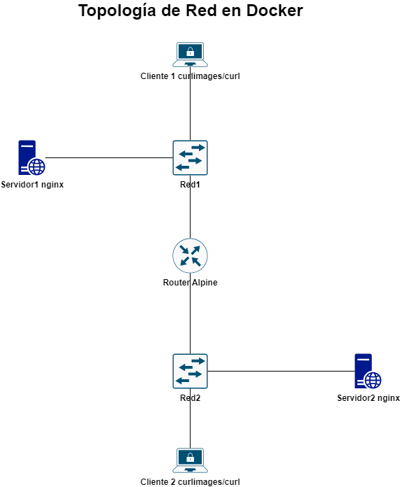

# Laboratorio de Networking Avanzado en Docker

## Objetivo
Aprender a configurar una topología de red avanzada en Docker, incluyendo el uso de contenedores como routers.

## Introducción
En este laboratorio, vamos a crear una topología de red avanzada utilizando Docker. Configuraremos varios contenedores para simular servidores y clientes, y utilizaremos contenedores adicionales para actuar como routers y facilitar la comunicación entre diferentes redes.

## Requisitos Previos
- Docker instalado en tu máquina
- Cuenta en GitHub

## Topología de red


## 1: Crear Redes Personalizadas
1. Crear dos redes personalizadas llamadas `red1` y `red2`
```bash
docker network create red1
docker network create red2
```

## 2:  Crear Contenedores de Servidores y Clientes
2. Crear un contenedor servidor en `red1`
- Iniciar un contenedor nginx en `red1`:
```bash
docker run -d --name servidor1 --network red1 nginx:latest
```
3. Crear un contenedor cliente en `red1`
- Iniciar un contenedor curl en `red1`:
```
docker run -it --name cliente1 --network red1 curlimages/curl
```
4. Crear un contenedor servidor en `red2`
- Iniciar un contenedor nginx en `red2`:
 ```bash
docker run -d --name servidor2 --network red2 nginx:latest
```
5. Crear un contenedor cliente en `red2`
- Iniciar un contenedor curl en `red2`:
```
docker run -it --name cliente2 --network red2 curlimages/curl
```
## 3: Crear un Contenedor Router
6. Crear un contenedor que actuará como router entre  `red1` y `red2`
- Usar una imagen que permita la configuración de iptables, por ejemplo, una imagen de Alpine con iptables instalado:
```Dockerfile
# router Dockerfile
FROM alpine:latest
RUN apk add --no-cache iptables
CMD ["sh", "-c", "while true; do sleep 3600; done"]
```
- Construir la imagen Docker para el router:
```bash
docker build -t router .
```
- Iniciar el contenedor router y conectarlo a ambas redes:
```bash
docker run -d --name router --network red1 --privileged router
docker network connect red2 router
```

## 4: Configurar el Router
7. Configurar iptables en el router para permitir el enrutamiento entre  `red1` y `red2`
- Obtener acceso al contenedor router:
```bash
docker exec -it router sh
```
- Habilitar el reenvío de paquetes y configurar iptables:
```sh
# Habilitar el reenvío de paquetes
echo 1 > /proc/sys/net/ipv4/ip_forward

# Configurar iptables para reenviar tráfico entre red1 y red2
iptables -t nat -A POSTROUTING -o eth1 -j MASQUERADE
iptables -A FORWARD -i eth1 -o eth0 -m state --state RELATED,ESTABLISHED -j ACCEPT
iptables -A FORWARD -i eth0 -o eth1 -j ACCEPT
```
##  5: Verificación de Conectividad y Resolución de Nombres
8. Verificar la conectividad entre los contenedores:
- Desde `cliente1`, probar la conectividad con `servidor1` y `servidor2`:
```bash
docker exec -it cliente1 curl servidor1
docker exec -it cliente1 curl <IP-del-servidor2>
```
- Desde `cliente2`, probar la conectividad con `servidor1` y `servidor2`:
```bash
docker exec -it cliente2 curl servidor1
docker exec -it cliente2 curl <IP-del-servidor2>
```
- Verificar que los contenedores pueden resolver nombres y conectarse a través del router.
##  6: Publicar en GitHub
9. Publica el contenido en un repositorio de GitHub:
- Crea un nuevo repositorio en GitHub.
- Sube los archivos Dockerfile y cualquier otro archivo necesario.

