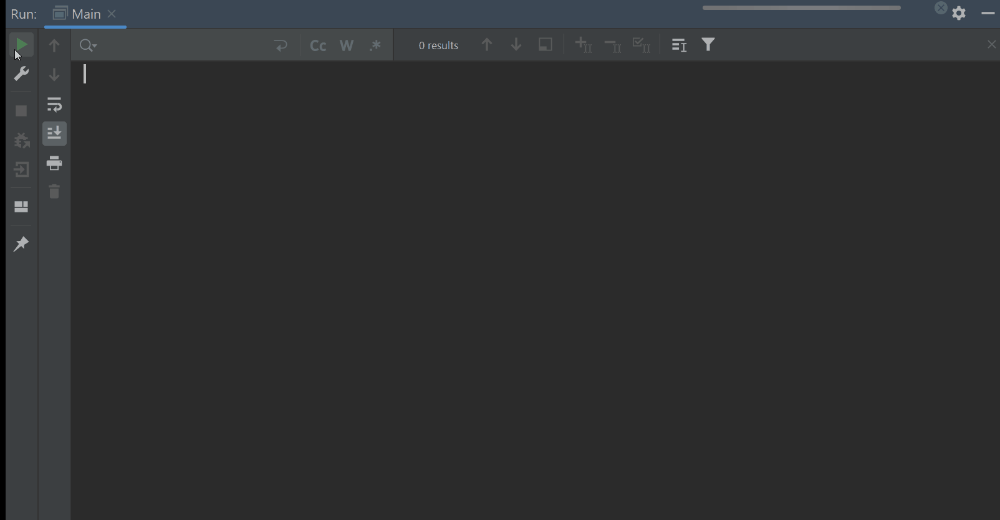

# Guia product-jdbc
### Descripcion
Este proyecto es la continuacion del **laboratorio 01**. El objetivo es persistir la tabla *productos* en una base de datos MySQL.
## Recomendacion
- Resolver el **laboratorio 1**
- Leer la teoria sobre la [API JDBC](https://classroom.google.com/c/NjU1ODE4ODczOTMx/m/NjU2MzA1MzAzNjg4/details)
- Resolver el [cuestionario ***JDBC***]( https://classroom.google.com/c/NjU1ODE4ODczOTMx/a/NjU2MzIwOTczMTYy/details)

### 1. Crear la base de datos ***sales_db***  y la tabla ***products***
~~~sql
-- script mysql
CREATE DATABASE sales_db;
USE sales_db;
--
-- Estructura de tabla para la tabla `products`
--

CREATE TABLE `products` (
  `idproduct` int(11) NOT NULL PRIMARY KEY AUTO_INCREMENT,
  `name` varchar(45) DEFAULT NULL,
  `price` decimal(10,2) DEFAULT NULL
) ENGINE=InnoDB DEFAULT CHARSET=utf8mb4 COLLATE=utf8mb4_general_ci;

--
-- Volcado de datos para la tabla `products`
--

INSERT INTO `products` (`name`, `price`) VALUES
('camisa', 50.10),
('pantalon', 100.00),
('corbata', 30.65),
('zapatos', 10.00),
('blusa', 10.35);
~~~
## 2. Crear un nuevo proyecto en java con nombre **product-jdbc**
- Proyecto Ant: Agregar la libreria [java-mysql-connector](https://downloads.mysql.com/archives/c-j/) version 8.0.33 
- Proyecto maven: Agregar la dependencia en el archivo **pom.xml**
~~~xml
 <dependencies>
        <dependency>
            <groupId>mysql</groupId>
            <artifactId>mysql-connector-java</artifactId>
            <version>8.0.33</version>
        </dependency>
</dependencies>
~~~
## 3. Copiar las clases ***Order*** y ***Product*** al **package** principal. Verificar que todo funciones antes de avanzar
- Codigo para la clase ***Product***
~~~java

public class Product {
    private Long idProduct;
    private String name;
    private Double price;
    private static Long countProduct;
    //Constructor con todos los parametros
    public Product(Long idProduct, String name, Double price) {
        //this.idProduct = ++countProduct;  // En esta version no es necesario el contador, ya que la base de
                                            // datos tiene el campo idProduct en auto_increment
        this.idProduct = idProduct;
        this.name = name;
        this.price = price;
    }
  //Constructor con todos 2 parametros se utiliza el el metodo save
    public Product(String name, Double price) {
        this.name = name;
        this.price = price;
    }
  //setters/getters
    public String getName() {
        return name;
    }

    public void setName(String name) {
        this.name = name;
    }

    public Double getPrice() {
        return price;
    }

    public void setPrice(Double price) {
        this.price = price;
    }

    @Override
    public String toString() {
        return "Product{" +
                "idProduct=" + idProduct +
                ", name='" + name + '\'' +
                ", price=" + price +
                '}';
    }
}
~~~
- Codigo para la clase ***Order***
~~~java
public class Order {
    private final int idOrder;
    private Product products[];
    private static int countOrders;
    private int countProducts;
    private static final int maxProducts = 10;

    public Order(){
        this.idOrder = ++countOrders;
        products = new Product[maxProducts];
    }
    public void addProduct(Product product){
        if(countProducts < maxProducts){
            products[countProducts] = product;
            countProducts++;
        }else {
            System.out.println("No se pueden agregar mas productos " + maxProducts);
        }
    }
    public double calculateTotal(){
        double total = 0;
        for(int i = 0; i < countProducts; i++){
            total += products[i].getPrice();
        }
        return total;
    }
    public void showOrders(){
        System.out.println("Orden #" + idOrder);
        System.out.println("Total de la orden # " + idOrder + ": $" + calculateTotal());
        System.out.println("Productos de la orden # " + idOrder);
        for(int i = 0; i < countProducts; i++){
            System.out.println(products[i]);
        }
    }
}
~~~
## 4. Crear la Clase ***DBConnection*** en un nuevo paquete llamado **util**. Esta clase conecta con la base de datos
- Codigo para la clase ***DBConnection***
~~~java
import java.sql.Connection;

public class DBConnection {
    private static Connection connection = null;
    private static final String url = "jdbc:mysql://localhost:3306/sales_db";
    private static final String user = "root";
    private static final String password = "";
    private static final String DRIVER = "com.mysql.cj.jdbc.Driver";

    public static Connection getConnection() {
        try {
            Class.forName(DRIVER);
            connection = java.sql.DriverManager.getConnection(url, user, password);
            System.out.println("successful connection");
        } catch (Exception e) {
            e.printStackTrace();
        }
        return connection;
    }
}
~~~

## 5. Crear la Clase ***ProductDao*** en un nuevo paquete llamado **dao**. Esta clase tiene la logica de negocio con la base de datos
- Codigo para la clase ***ProductDao***
~~~java

import java.sql.Connection;
import java.sql.PreparedStatement;
import java.sql.ResultSet;
import java.sql.SQLException;
import java.util.ArrayList;
import java.util.List;

public class ProductDao {
    private final Connection connection = DBConnection.getConnection();
    private PreparedStatement preparedStatement;
    private ResultSet resultSet;
    private String query;

    //Listar todos los productos
    public List<Product> listAllProducts() {
        List<Product> products = new ArrayList<>();
        query = "SELECT * FROM products";
        try {
            preparedStatement = connection.prepareStatement(query);
            resultSet = preparedStatement.executeQuery();
            while (resultSet.next()) {
                products.add(new Product(resultSet.getLong("idProduct"), resultSet.getString("name"),
                        resultSet.getDouble("price")));
            }
        } catch (SQLException e) {
            e.printStackTrace();
        }
        return products;
    }

    //Buscar un producto por su id
    public Product findById(Long id) {
        query = "SELECT * FROM products WHERE idproduct = ?";
        try {
            preparedStatement = connection.prepareStatement(query);
            preparedStatement.setLong(1, id);
            resultSet = preparedStatement.executeQuery();
            if (resultSet.next()) {
                return new Product(resultSet.getLong("idproduct"), resultSet.getString("name"),
                        resultSet.getDouble("price"));
            }
        } catch (SQLException e) {
            e.printStackTrace();
        }
        System.out.println("Product not found");
        System.exit(1); // Terminates the program with exit code 1.
        return null;
    }

    public void save(Product product) {
        query = "INSERT INTO products (name, price) VALUES (?, ?)";
        try {
            preparedStatement = connection.prepareStatement(query);
            preparedStatement.setString(1, product.getName());
            preparedStatement.setDouble(2, product.getPrice());
            preparedStatement.executeUpdate();
        } catch (SQLException e) {
            e.printStackTrace();
        }
        System.out.println("Product saved");
        //System.exit(1); // Terminates the program with exit code 1.
    }

~~~
- Codificar en esta clase los metodos ***delete*** y ***update***

## 6. En la Clase que contiene el metodo ***main*** crear una interfaz de usuario.
- Codigo para el metodo ***main***
~~~java
import java.util.List;
import java.util.Scanner;

public class Main {
    public static void main(String[] args) {

        Scanner scanner = new Scanner(System.in); //para leer el teclado equivale a scanf o cin en C y C++

        ProductDao productDao = new ProductDao(); //objeto de acceso a datos
        Order order = new Order(); //crea una nueva orden de compra

        while (true) { //menu de opciones
            System.out.println("1. Listar productos"); //equivale a printf o cout en C y C++
            System.out.println("2. Agregar producto a la orden de compra");
            System.out.println("3. Ver orden de compra");
            System.out.println("4. Salir");
            int opcion = Integer.parseInt(scanner.nextLine()); //lee la opcion del teclado

            if (opcion == 1) {
                List<Product> products = productDao.listAllProducts(); //lista todos los productos en pantalla
                for (Product product : products) {
                    System.out.println(product);
                }
            } else if (opcion == 2) {

                while (true) {
                    System.out.println("Ingrese ID del producto o 0 para terminar");
                    int id = Integer.parseInt(scanner.nextLine());
                    if (id == 0) {
                        break;
                    }
                    order.addProduct(productDao.findById(id));
                }

            } else if (opcion == 3) {
                order.showOrders();
            }else if (opcion==4){
                break;
            }
        }
    }
}
~~~
## Simulacion de la aplicacion terminada

## 7. Crear las opciones para borrar y actualizar
