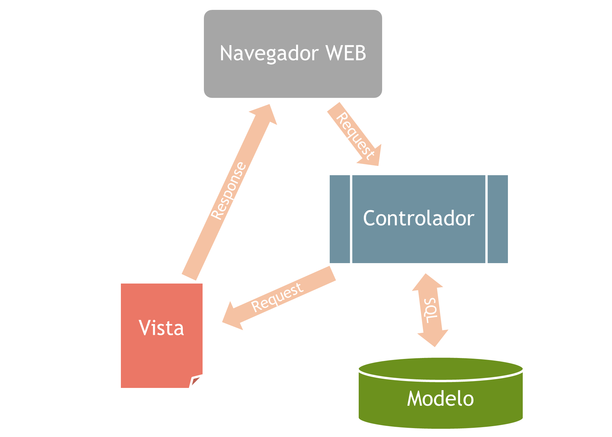
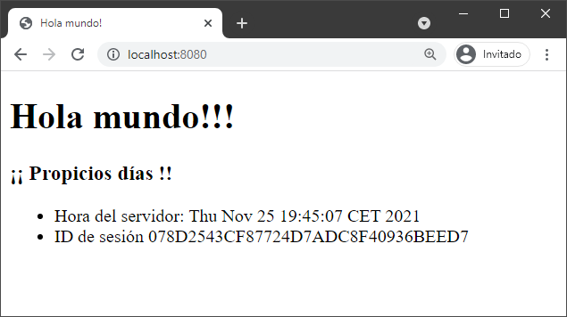
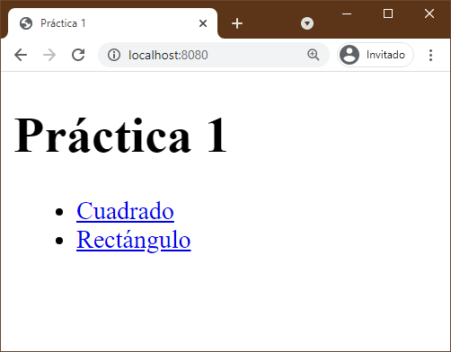
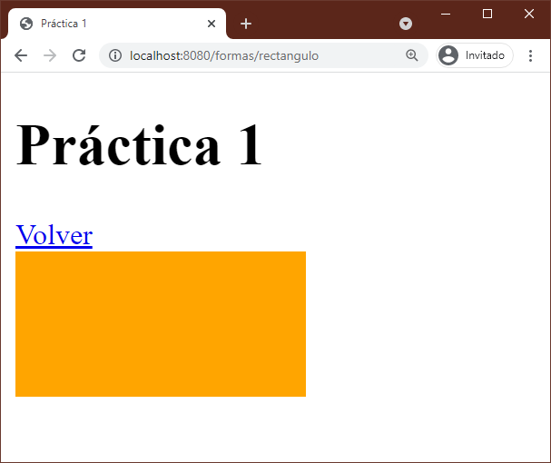
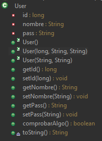

# Índice

[TOC]

------

# Spring MVC

El framework Spring integra el patrón MVC (Modelo-Vista-Controlador). Expliquemos un poco en qué se basa el patrón MVC y después pasaremos a ver como se aplica dentro de Spring.

MVC consiste en separar el modelo de datos (base de datos), la vista que los representa (html, jsp, etc.), y la lógica de la aplicación (controladores). 



Los dispositivos envían peticiones al controlador, que es el encargado de satisfacer los requerimientos del cliente, recuperando los valores del modelo de datos y enviándoselo a la vista, que será la encargada de representar la forma en que los datos se visualizarán. Esas vistas se envían a un navegador web que será el encargado de mostrarlo al cliente. 

Cada capa será independiente del resto, por lo que no podremos, por ejemplo, hacer conexiones con la base de datos desde un archivo *jsp* o *thymeleaf*. La forma correcta sería hacer la lógica de la conexión desde un controlador (*servlet*), y enviar los datos necesarios por el *request* a la vista.

# Controladores

El controlador es una evolución de los “antiguos” servlets. Gestiona peticiones (usualmente acciones del usuario) e invoca consultas al 'modelo' cuando se hace alguna solicitud sobre la información (por ejemplo, consultar un registro en una base de datos). También puede enviar objetos a su 'vista' asociada, por lo que podemos decir que el controlador hace de mediador entre el modelo de datos y las vistas.

Se pueden crear tantos controladores como sean necesarios, para organizar mejor el código. Por ejemplo, supongamos que tenemos una aplicación que gestiona pedidos, y tiene clientes y proveedores. Pues nuestra aplicación tendría un `HomeController` (equivalente al FrontServlet), `PedidosController`, `ClientesController` y `ProveedoresController`. En cada controlador ubicaremos los métodos para controlar cada parte de la aplicación. Realmente se podría hacer todo en un gigantesco Controlador, pero ya puedes imaginar que sería más complicado escalar y mantener esa aplicación.

En el **HolaMundo** anterior, ya deberíamos tener un `HomeController.java` creado, pero para entenderlo mejor, podemos borrar el archivo y empezamos de 0, explicando ahora si, paso a paso.

Para crear un nuevo controlador, seguiremos los siguientes pasos:

1. Creamos una clase normal en un paquete adecuado. Normalmente en un paquete llamado `controllers`.

   ```java
   package com.ejemplo.holamundo.controllers;
   
   public class HomeController {
      
   }
   ```

2. Para convertir esa clase en un **Controller**, solo tendremos que usar la anotación `@Controller` sobre la clase y hacer la importación. Ya tenemos nuestro controlador creado. No hay más.

   ```java
   package com.ejemplo.holamundo.controllers;
   import org.springframework.stereotype.Controller;
   
   @Controller
   public class HomeController {
      
   }
   ```

3. Con el siguiente código, hacemos que cualquier petición a la url indicada en la anotación `@RequestMapping("url")`, Spring realizará una llamada al método indicado.

   ```java
   @Controller
   public class HomeController {
      @RequestMapping("/")
      public String home() {
         return "home";
      }
    }
   ```

4. En nuestra aplicación, cada vez que vayamos a  la url `/` nos llevará a la vista `home.html`.

5. La vista `home.html`, es tan sólo un archivo HTML convencional en el que al indicarle el atributo `xmlns:th="http://www.thymeleaf.org"` le estamos proporcionando una serie nueva de atributos a las etiquetas de HTML que dotarán a las vistas de la capacidad de ser páginas dinámicas de servidor, que se procesarán en tiempo de ejecución (como las antiguas JSP). En nuestro ejemplo, no usamos nada especial de Thymeleaf, por ahora.

## Consideraciones

🍃Con la anotación `@RequestMapping("url")` le indicamos que cuando la app se dirija a esa url, se debe ejecutar el método `home()`. El nombre del método puede llamarse como quieras, pero debería ser descriptivo. 

🍃 Con `@RequestMapping("url")`, recibiremos las peticiones que vengan tanto por `GET` como por `POST`. También podemos diferenciarlas si lo necesitamos con `@GetMapping()` y `@PostMapping()`

🍃 Los métodos siempre seguirán la misma estructura, es decir, puede llamarse como quieras, y devolverá un String. Ese String será el nombre de la vista a la que va a dirigirse. No hace falta indicar el prefijo `src/main/resources/templates`. No hace falta indicar el sufijo `.html`. 

🍃 No necesitamos `RequestDispatcher`, `forward`, ni crear un servlet individual con su `doGet` y/o `doPost` por cada url a controlar. Creamos un controlador y añadimos tantos métodos con su correspondiente `RequestMapping` como queramos.

🍃 Hay muchas otras firmas de métodos que Spring también reconocería, pero esa es la más extendida y simple. Siempre puedes mirar la [documentación oficial](https://docs.spring.io/spring-framework/docs/current-SNAPSHOT/reference/html/web.html#mvc) y flipar🤯.

🍃 Con el uso de anotaciones (presentes desde la versión 2.5 de Spring), nos hemos evitado tener que declarar cada Controlador y cada vista en laberínticos archivos xml de configuración, y muchas más ventajas que veremos más adelante, como el paso de parámetros por anotaciones, recuperar e insertar objetos en la sesión, sistemas de seguridad implícitos y en definitiva **haciendo más fácil las tareas cotidianas y repetitivas** de una aplicación web.

# Paso de información controlador-vista

Vamos a enviar alguna información desde el controlador a la vista. Es decir, desde el código de la capa de negocio en `HomeController.java` hasta la capa de la vista en `home.html`. 

**Recordemos como se hace en JavaEE:**

```java
public class HomeServlet extends HttpServlet {  
    public void doPost(HttpServletRequest request, HttpServletResponse response)  
        throws ServletException, IOException {  

        //Adjuntamos mensaje en el request
        String saludo = "¡¡Propicios días!!. Mensaje desde el controlador";
        request.setAttribute("mensaje", saludo);
        
        //Enviamos el request a home.html
        RequestDispatcher rd = request.getRequestDispatcher("home.html");
        rd.forward(request, response);
    }  
}  
```

Necesitábamos el objeto `request` para adjuntarle lo que quisiéramos con el método `request.setAttribute()`, para después recuperarlo desde JSP con `request.getAttribute()`, o usando la librería JSTL. Además de toda la ceremonia que era tratar con el objeto `request` de un sitio para otro.

Viendo el código del controlador anterior `HomeController`, ¿Dónde está el `request`? ¿Si no tengo el `request`, como adjuntamos objetos a las vistas? ¿O como sacamos el `session`? **La solución inyectar los objetos** que necesitemos en los métodos de los controladores. 

**Ahora veremos como se hace en Spring:**

```java
@RequestMapping("/")
public String home(Model model) {
   String mensaje = "¡¡ Propicios días!! Mira mama, en dos líneas!!";
   model.addAttribute("saludo", mensaje);
   return "home";
}
```

- Lo único que hacemos es inyectar (poner un objeto de la interfaz Model) en los parámetros del método y ya lo tenemos disponible para usarlo.

- El objeto de la interfaz Model representa el modelo de datos, y podemos adjuntarle cualquier otro objeto, usando su método:

  - `addAttribute(string, object)` -> Recibe un String y un Object. El String indica el nombre con el que vamos a guardar el Object dentro del modelo. Igual que el `setAttribute` de `Request`, `Session` y `Application`.
  - No contiene un método tipo `removeAttribute()`, por lo que si queremos eliminar un objeto del model (algo raro), siempre podemos hacer `addAtributte("mensaje", null)`.

- Otros objetos que podemos inyectar son el `Request`, `Response`, `Session` y con inyectarlos de la misma forma que el model, podríamos usarlos en el método. Una mala práctica sería inyectar objetos que no se vayan a usar, por ejemplo, si no vamos a guardar objetos en el modelo, no lo inyectamos en el método.

- Podemos inyectar cualquier objeto que necesitemos en los métodos que los necesitemos.

  ```java
  @RequestMapping("/")
  public String home(Model model, HttpSession session) {
     GregorianCalendar calendario = new GregorianCalendar(); 
     String ahora = calendario.getTime().toString();
     
     model.addAttribute("saludo", "¡¡ Propicios días !!");
     model.addAttribute("serverTime", ahora);
     model.addAttribute("sessionId", session.getId());
     
     return "home";
  }
  ```

- Como vemos en el ejemplo anterior, inyectamos el `Model` y el `HttpSession`, y obtenemos la id de la sesión con `session.getId()` y la añadimos como atributo al `model`. Y no nos olvidamos de enviar un saludo, la educación por delante 🙂.

Ya hemos enviado los atributos del controlador a la vista, ahora nos quedaría como recuperar esos atributos y mostrarlos en la página `home.html`. 

En la vista podemos tener el siguiente código:

```html
<body>
    <h1>Hola mundo!!!</h1>
    <h3 th:text="${saludo}"></h3>
    <ul>
        <li>
            <span>Hora del servidor:</span>
            <span th:text="${serverTime}"></span>
        </li>
        <li>
            <span>ID de sesión:</span>
            <span th:text="${sessionId}"></span>
        </li>
    </ul>
</body>
```

Con los atributos `th:*` podemos acceder a los atributos que hay en el `model` y mostrarlos directamente en la vista en los elementos HTML que queramos. 




# Práctica 1. Controladores.

Crear un proyecto nuevo Spring Boot, con las dependencias de `Spring MVC` y `Thymeleaf`. 

- Tendrá un controlador llamado `HomeController` que al llegar una petición a la url raíz (`/`) llevará a una vista llamada `index.html`. 
- La vista `index.html` tendrá el siguiente contenido:
- 
- Cada enlace llevará a dos vistas, `cuadrado.html` y `rectangulo.html`. Ambas estarán en una carpeta llamada `/pages` en la carpeta donde van las vistas.
- Para dirigir desde un controlador a las vistas que queremos, vamos a crear un **nuevo controlador** llamado `FormasController`. Podríamos hacerlo en el mismo `HomeController`, pero así hacemos nuestro programa más escalable.
- Las rutas para ir a las vistas serán:
  - Para ir a `cuadrado.html` usaremos la url `/formas/cuadrado`.
  - Para ir a `rectangulo.html` usaremos la url `/formas/rectangulo`.
  - 💡Se pueden crear *mappings* parciales asignando un parte de la ruta al controlador, y otra parte al método. `/formas`, `/cuadrado` y `/rectangulo`, en lugar de `/formas/cuadrado` y `/formas/rectangulo`. Sería una buena idea hacerlo aquí.
  - 💡Prueba primero las rutas a mano en el navegador, y cuando funcione usa esas urls para los enlaces.
  - 💡Experimenta con `@RequestMapping` y `@GetMapping`.
- Los enlaces de `index.html` usarán las rutas que hemos definido en los controladores. Prueba a usar la ruta de una vista directamente.
- En las vistas `rectangulo.html` y `cuadrado.html`, tendrán lo que prometen. Un cuadrado y un rectángulo. Y un enlace que nos vuelva a `index.html`. Las figuras las puedes hacer con un `<div>` y dándole directamente un `width`, `height` y un `background-color`. Puedes usar estilos con el atributo `style=""` o con la etiqueta `<style>` **desde el mismo HTML**.
  - 
  - 💡Para usar un archivo externo de CSS, ¿en qué ruta deberemos colocarlos? ¿Cómo los referenciamos?

# Introducción a Thymeleaf

*Thymeleaf* es una biblioteca Java que implementa un motor de plantillas HTML5 que puede ser usado en entornos web. Se acopla perfectamente para trabajar en la capa vista del MVC. Proporciona un módulo opcional para la integración con Spring MVC, por lo que se usa para reemplazar completamente a los archivos JSP en las aplicaciones web.

El objetivo principal de Thymeleaf es permitir la creación de plantillas de una manera elegante y un código formateado, sin usar etiquetas nuevas de HTML, si no extiendo sus capacidades con nuevos atributos. Por esta razón, obtendremos un archivo HTML fácil de entender sin rastro de código java, como podía pasar en las JSP.

También ofrece la característica llamada ***plantillas naturales***, que se basa en que un navegador pueda abrir la plantilla de forma estática (sin procesar) y se pueda mostrar sin problemas. Esto permitirá a los equipos de diseño y desarrollo trabajar en el mismo archivo de plantilla y reducirá el esfuerzo requerido para transformar un prototipo estático en un archivo de plantilla funcional.

Podemos encontrar la documentación oficial en https://www.thymeleaf.org/documentation.html.

Otra documentación interesante se puede encontrar en https://frontbackend.com/thymeleaf/thymeleaf-tutorial.

A continuación vamos a ver ejemplos de las estructuras básicas de cualquier lenguaje de programación que se pueden usar en Thymeleaf.

## Mostrar información del modelo
Para mostrar cualquier objeto enviado desde el controlador a la vista HTML, usaremos el atributo `th:text` en el elemento HTML que queramos, y así sustituir el contenido HTML por el valor del atributo:

```java
//Desde el controlador java...
String usuario="salva@formador.es";
model.addAttribute("nombre", usuario);
```

```html
<!-- Desde HTML -->
<p th:text="${nombre}">El contenido del pára será eliminado</p>
```

Como valor del atributo, `th:text` usa *Expression Language* (EL). En resumen, se usa la sintaxis `${ }` y se evalúa la expresión de su interior. Puede ser el contenido de una variable u otra expresión más compleja. Por ejemplo `${nombre.toLowerCase() + '!!!' }`

El texto de `El contenido del párrafo será eliminado`, será sustituido en tiempo de compilación por el resultado de la expresión `nombre`, por lo que la plantilla una vez compilada, quedará de la siguiente forma:

```html
<p>salva@formador.es</p>
```

También podemos usar la siguiente sintaxis para mostrar expresiones dentro del contenido de las etiquetas. Los siguientes párrafos obtendrían el mismo resultado en pantalla. En muchos casos donde se intercalan varios textos fijos y expresiones, mejoraría la legibilidad. Igual que los *string templates* de JavaScript.

```html
<p>Bienvenido, [[${usuario.nombre}]]. Tu rol es [[${usuario.rol}]].</p>
<p>Bienvenido, <span th:text="${usuario.nombre}"></span>. Tu rol es <span th:text="${usuario.rol}"></span>.</p>
```


## Condicionales IF y UNLESS

### If

Se pueden hacer estructuras condicionales con el atributo `th:if`. 

```html
<div th:if="${user.esAdmin()}">Panel de administrador</div>
```

Al compilar la plantilla, INCLUIRÁ el elemento sólo si la expresión indicada es `true`. En caso contrario no se incluirá elemento `<div>` en el HTML de respuesta. La vista quedaría así en caso de ser la expresión verdadera.

```html
<div>Panel de administrador</div>
```

### Unless

Con el atributo `th:unless` hacemos justamente lo contrario. Sería como el bloque `else` de cualquier lenguaje de programación.

```html
<a th:unless="${edad < 18}" href='www.paginasdemayores.com'>Página Secretas</a>
```

Si el usuario es menor de edad NO se mostraría el enlace.

## Switch

También posee estructuras de tipo **switch-case**. Así nos evitaríamos en algunos casos varias sentencias `th:if` y quedaría un código más limpio y escalable. Se usaría la siguiente sintaxis:

```html
<div th:switch="${user.rol}">
  <p th:case="'admin'">Usuario es administrador</p>
  <p th:case="'${roles.manager}'">Usuario es manager</p>
  <p th:case="${roles.editor}">Usuario es editor</p>
  <p th:case="*">El usuario es otra cosa</p>
</div>
```

## Bucle FOR

También podemos recorrer una colección de elementos con una estructura **FOR**. Es muy parecido a un for each. Repite el elemento HTML tantas veces como elementos haya en la colección. 

Desde el controlador que deseemos generamos la colección que queramos y la adjuntamos al `model`.

### Ejemplo con String[] en una lista no numerada

```java
@GetMapping("/test/for-array")
public String pruebaArray(Model model) {
    String listaCompra[] = {"Pepinos", "Tomates", "Patatas", "Pimientos"};
    model.addAttribute("lista", listaCompra);
    return "lista-compra";
}
```

Y desde HTML la mostramos así:

```html
...
<body>
    <h3>Lista de la compra</h3>
    <ul>
        <li th:each="articulo : ${lista}">
            <span th:text="${articulo}"></span>
        </li>
    </ul>
</body>
```

Una vez compilada, obtendríamos el siguiente código fuente en el cliente:

```html
...
<body>
    <h3>Lista de la compra</h3>
    <ul>
        <li>
            <span>Pepinos</span>
        </li>
        <li>
            <span>Tomates</span>
        </li>
        <li>
            <span>Patatas</span>
        </li>
        <li>
            <span>Pimientos</span>
        </li>
    </ul>
</body>
```

### Ejemplo con un ArrayList de objetos en una tabla HTML

Ahora en lugar de un array simple de Strings, vamos a crear un `ArrayList<Articulos>` y mostraremos esos datos en una tabla HTML

En el controlador:

```java
@GetMapping("/test/for-arraylist")
public String pruebaArrayList(Model model) {
    List<Articulo> listaArticulos = new ArrayList<Articulo>();
    listaArticulos.add(new Articulo(1, "Agua Chumicero 1.5L", 0.70));
    listaArticulos.add(new Articulo(3, "Refresco con gas sabor cola", 1.35));
    listaArticulos.add(new Articulo(1, "Campero Pollo y Bacon XXL", 6));
    listaArticulos.add(new Articulo(1, "Pizza Barbacoa", 7));
    listaArticulos.add(new Articulo(1, "Ración Patatas fritas", 3.2));

    model.addAttribute("lista", listaArticulos);

    return "ticket";
}
```

En la vista:

```html
<h3>Ticket</h3>
<table>
    <tr>
        <th>Cantidad</th>
        <th>Descripción</th>
        <th>Precio</th>
        <th>Total</th>
    </tr>
    <tr th:each="articulo : ${lista}">
        <td th:text="${articulo.cantidad}"></td>
        <td th:text="${articulo.descripcion}"></td>
        <td th:text="${articulo.precio}"></td>
        <td th:text="${articulo.cantidad * articulo.precio + '€'}"></td>
    </tr>
</table>
```

Generaría el siguiente HTML final:

```html
<h3>Ticket</h3>
<table>
    <tr>
        <th>Cantidad</th>
        <th>Descripción</th>
        <th>Precio</th>
        <th>Total</th>
    </tr>
    <tr>
        <td>1</td>
        <td>Agua Chumicero 1.5L</td>
        <td>0.7</td>
        <td>0.7€</td>
    </tr>
    <tr>
        <td>2</td>
        <td>Refresco con gas sabor cola</td>
        <td>1.35</td>
        <td>2.7€</td>
    </tr>
    <tr>
        <td>3</td>
        <td>Campero Pollo y Bacon XXL</td>
        <td>6.0</td>
        <td>18.0€</td>
    </tr>
    <tr>
        <td>4</td>
        <td>Pizza Barbacoa</td>
        <td>7.0</td>
        <td>28.0€</td>
    </tr>
    <tr>
        <td>5</td>
        <td>Ración Patatas fritas</td>
        <td>3.2</td>
        <td>16.0€</td>
    </tr>
</table>
```


### Accediendo al índice y tamaño del bucle for each

Si necesitamos acceder al tamaño de la lista o bien al índice actual del bucle, podemos añadir una nueva variable tal y como se ve en el siguiente ejemplo:

```html
<tr th:each="producto, iterador : ${productos}">
    <td th:text="${producto.nombre}"></td>
    <td th:text="${producto.precio}"></td>
    <td th:text="${(iterador.index+1) + '/' + iterador.size }"></td>
</tr>
```

La variable `iterador`, tiene las siguientes propiedades:

- `index`, indica el índice del bucle, empezando por 0.
- `count`, indica el índice del bucle, empezando por 1.
- `size`, indica el tamaño total de la colección que estamos recorriendo.


### Ejemplo usando un for con índices

También podemos hacer un bucle for tradicional que recorra una secuencia de números. Le indicamos un inicio, un final y opcionalmente un incremento. Podemos verlo más fácil con un ejemplo:

```html
<select name="foo">
	<option th:each="i : ${#numbers.sequence(1, 10, 2)}" th:value="${i}" th:text="'No.' + ${i}"></option>
</select>
```

Con `${#numbers.sequence()}`, creamos la secuencia que queremos recorrer. El método `.sequence()` recibe 3 parámetros. El primero es el inicio de la secuencia, el segundo es el final de la secuencia, y el último, que es opcional, es el incremento en cada iteración, si no lo indicamos por defecto será 1. 

El ejemplo generaría el siguiente HTML:

```html
<select name="foo">
    <option value="1">No. 1</option>
    <option value="3">No. 3</option>
    <option value="5">No. 5</option>
    <option value="7">No. 7</option>
    <option value="9">No. 9</option>
</select>
```


## Comentarios en el servidor

También se pueden usar comentarios de código que serán eliminados en la parte del servidor al procesar la plantilla. Hay que usar la sintaxis `<!--/*    */-->` , que es la de los comentarios HTML y CSS juntos. Tal y como se ve en el siguiente ejemplo.

```html
<!--/* Este comentario será eliminado al procesar el archivo Thymeleaf */-->
<!-- Y este comentario si llegará al navegador del cliente -->
```


## Consideraciones

Hay que tener en cuenta que para que Thymeleaf funcione correctamente usando las Spring EL como `${articulo.nombre}`, el objeto `Articulo` deberá:

- Tener un constructor por defecto siempre. Aunque no sea estrictamente necesario ahora, es aconsejable que nos acostumbremos para cuando usemos beans, que si que será obligatorio para la persistencia con JPA.
- **Tener los *getters* y *setters* bien construidos**. Los identificadores serán `get` o `set` + nombre del atributo con la primera letra en mayúsculas. Ejemplo: `getPrecio()` `setPrecio()`. Y si es el getter de un booleano se llamará `is` + nombre del atributo booleano con la primera en mayúsculas. Ejemplo: `isAdmin()`. No sería válido `getAdmin()`.
- Si tienen los getters y setters bien, al escribir `${articulo.precio}` estaremos haciendo una llamada al método `articulo.getPrecio()`. De ahí que tengan que estar de una forma concreta. Siempre se podrán llamar directamente con `${articulo.getPrecio()}`.
- Tener el método `.toString()` implementado. Si imprimimos directamente `${articulo}` hará una llamada a `articulo.toString()` por lo que debería existir.
- También desde Thymeleaf podemos llamar directamente a los métodos de las clases, aunque no sean *getters* ni *setters*:

```html
<th th:text="${articulo.calcularPVP()}"></th>
```

# Práctica 2. Thymeleaf

Hacer una aplicación Spring Boot MVC (Spring Starter Proyect) que tenga:

**Tendrá las siguientes vistas:**

- `home.html` -> Añádele algunos elementos HTML de atrezo simulando una barra de navegación. Deberá tener un enlace que nos lleve a listado.html (nos llevará a un controlador que a su vez nos llevará a la vista, nunca de vista a vista).
- `listado.html` -> Se mostrará un listado en una tabla HTML. 

**Tendrá el siguiente POJO:**

- `User.java`. En la siguiente imagen se detallan los atributos (rojo) y métodos (verde). El método `comprobarAlgo()` devuelve un true si la id es par, o un false en caso contrario. De esta forma, todas las llamadas al método siempre darán el mismo resultado.
- 

**Tendrá los siguientes controladores:**

- `HomeController` -> URL Mapeada `/` : Nos redirige inicialmente a `home.html` directamente.
- `ListadosController` -> URL Mapeada `/listados` : Creará un `ArrayList` de Objetos `User`. Los usuarios se crearán manualmente (5 ó 6). Se añaden también manualmente al ArrayList y se lo enviará a la vista `listado.html`. 

✔En la vista `listado.html` se mostrará en una tabla HTML, visualizando cada elemento del ArrayList (usuario) en una fila. 

✔En la última columna usar el resultado que nos devuelva el método `comprobarAlgo()`, para mostrar SI o NO (`true` o `false` respectivamente). Se puede usar un icono, imagen, emoji (✅❎) o simple texto, como quieras, pero no podrá salir `true` o `false` directamente.

✔Mostraremos en algún sitio del listado, donde te parezca más oportuno, el número de elementos que tiene la tabla (número de usuarios que hay en la lista).

✔Podemos añadirle un método a la clase `User`, que devuelva la contraseña oculta (sustituir cada carácter por un asterisco). Mostrar en el listado la contraseña oculta.

✔Distribuir los objetos Java en paquetes. No mezclar los controladores con los pojos.


